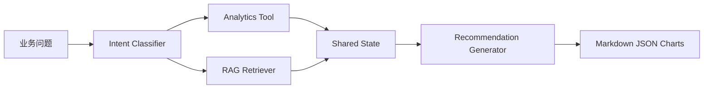

# Supply Chain Agent RAG Demo

- Agent 工作流编排
- RAG/知识库检索
- 供应链数据分析与可视化
- 可追溯的 Markdown/JSON 证据输出
- GitHub 可发布的完整仓库结构

这个项目的目标不是做一个空泛的聊天机器人，而是做一个能解释业务问题、调用数据分析、引用 SOP 文档、给出处置建议的供应链 Copilot。

## 1. 项目亮点

- 具备 AI 应用开发基础: 项目包含完整 Python 工程结构、CLI 入口、可测试模块和可发布文档。
- 熟悉 Agent 工作流: `question -> intent classification -> data analysis -> RAG retrieval -> action generation -> report export`
- 熟悉 RAG/知识库构建流程: 使用 `knowledge_base/` 中的 SOP 文档作为企业知识源，执行轻量检索和证据引用。

- 业务场景是供应链/物流异常管理，不是通用问答 Demo。
- 输出是可证明的: 有样例数据、有运行产物、有图表、有 Markdown 报告、有 JSON 结果。

## 2. 功能概览

### Agent 能力

- 自动识别问题类型: 缺货、延迟、供应商交期、KPI 分析
- 调用数据分析模块，生成服务水平和库存风险证据
- 调用知识库检索模块，返回相关 SOP 文档
- 组合业务建议、行动项和证据链

### 数据分析能力

- 订单履约率 / Service Level
- 准时交付率 / On-time Delivery
- 平均延迟小时数
- 高风险仓库和 SKU 识别
- 供应商 lead time 风险定位

### 可证明产物

- `outputs/demo_report.md`: 结构化业务报告
- `outputs/demo_result.json`: 机器可读结果
- `outputs/on_time_by_region.png`: 区域履约图表
- `outputs/inventory_risk.png`: 库存风险图表

## 3. 项目结构

```text
supply-chain-agent-rag-demo/
├── data/
├── docs/
├── knowledge_base/
├── outputs/
├── scm_copilot/
├── tests/
├── main.py
├── README.md
└── requirements.txt
```

## 4. 技术架构



## 5. 快速开始

### 安装依赖

```bash
python -m pip install -r requirements.txt
```

### 运行 Demo

```bash
python main.py --question "华东仓SKU-C连续缺货并导致订单延迟，请给我一份处理建议和证据"
```

### 运行测试

```bash
python -m unittest tests.test_smoke
```

## 6. 示例问题

- `华东仓 SKU-C 缺货导致连续延迟，怎么处理？`
- `请从订单和库存数据里找出最危险的仓库和 SKU。`
- `哪家供应商最可能导致交期风险？给我结合 SOP 的建议。`
- `给我一份适合周会汇报的履约分析摘要。`

## 7. 默认输出说明

项目默认支持两种模式:

- 离线模式: 不依赖外部大模型 API，使用本地规则化 Agent 工作流直接生成可演示结果。
- LLM 模式: 如果设置 `OPENAI_API_KEY` 与 `OPENAI_BASE_URL`，则可切换为真实大模型总结。

### 可选环境变量

```bash
OPENAI_API_KEY=your_key
OPENAI_BASE_URL=https://api.openai.com/v1
OPENAI_MODEL=gpt-4.1-mini
```